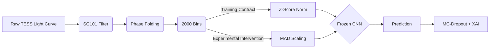

---
title: "When Robust Scaling Becomes a Representation Shift: An Empirical Study of Z-Score and MAD Normalization for TESS Transit Classification"
description: "Why mathematically superior preprocessing techniques can fatally degrade an astrophysics pipeline if they alter the statistical distribution learned by the neural network."
pubDate: 2026-08-16
tags: ["Astrophysics", "Machine Learning", "TESS", "Data Normalization", "Representation Shift"]
coverImage: "/portfolio/images/TESS.jpg"
---

*🔗 Source Code: [github.com/K4yan0/exoplanet-detection-ml](https://github.com/K4yan0/exoplanet-detection-ml)*

## 1. Abstract
In machine learning, robust scaling is universally prescribed as the antidote to datasets plagued by extreme outliers. In the realm of exoplanet transit detection, where massive stellar flares frequently distort the pristine light curves of distant stars, replacing standard **Z-Score normalization** with the robust **Median Absolute Deviation (MAD)** seems like an obvious upgrade. 

However, in this empirical case study, we demonstrate that indiscriminately swapping statistical normalizations on a pre-trained 1D Convolutional Neural Network (CNN) produces an immediate representation shift. Using Explainable AI (XAI) and Monte Carlo Dropout for uncertainty mapping, we illustrate how MAD scaling inadvertently redistributes the stochastic noise floor of the TESS dataset, triggering a subtle but mathematically measurable degradation in performance and calibration.

## 2. Why Normalization Matters for Transit Classification
The Transiting Exoplanet Survey Satellite (TESS) provides continuous light curves covering vast swaths of the sky. To prepare these raw photon counts for deep learning, they must be normalized.

### The Z-Score Baseline
Our V1 reference architecture utilized standard Z-score standardization:
$$ z = \frac{x - \mu}{\sigma} $$
Where $\mu$ is the mean flux and $\sigma$ is the standard deviation. Because standard deviation is highly sensitive to outliers, a single massive stellar flare artificially inflates $\sigma$, structurally compressing the microscopic dip of a planetary transit into statistical noise.

### The MAD Hypothesis
To insulate the pipeline against stellar flares, we hypothesized that **Robust Scaling** would preserve the signal. We implemented scaling based on the Median Absolute Deviation (MAD):
$$ \text{MAD} = \text{median}(|x_i - \text{median}(X)|) $$
$$ x_{\text{robust}} = \frac{x - \text{median}(X)}{\text{MAD} \times 1.4826} $$
Because MAD ignores the numerical magnitude of outliers, the transit depth would remain mathematically un-squashed, theoretically boosting the recall of small Earth-like planets orbiting active M-Dwarf stars.

## 3. Experimental Design and Controls
To test this, we fed identical TESS target cohorts through the two distinct preprocessing pipelines and passed them into a **frozen, strictly controlled 1D CNN**. 

To ensure a rigorous comparison, every aspect of the pipeline was held strictly constant, isolating the normalization algorithm as the sole independent variable.

| Component | V1 Baseline | Exp 2 Intervention |
| :--- | :--- | :--- |
| **Dataset cohort** | Same | Same |
| **Train/test split** | Same | Same |
| **SG filter** | 101 | 101 |
| **Sectors** | 1 | 1 |
| **Clipping** | None | None |
| **Model weights** | Frozen | Frozen |
| **Normalization** | Z-score | MAD |
| **Independent variable** | - | **Scaling method** |

## 4. Z-Score vs MAD Results
The experimental result contradicted our initial hypothesis. Rather than boosting planetary recall, the MAD-scaled data systematically degraded the performance of the frozen model across all three classification categories. 

| Metric | Z-Score | MAD Scaling | Δ |
| :--- | :--- | :--- | :--- |
| **Accuracy** | 0.7771 | 0.7429 | -0.0342 |
| **ROC-AUC** | 0.9089 | 0.8902 | -0.0187 |
| **Planet F1** | 0.7899 | 0.7731 | -0.0168 |
| **EB F1** | 0.8519 | 0.8077 | -0.0442 |
| **Noise F1** | 0.6992 | 0.6614 | -0.0378 |

## 5. Calibration and Uncertainty
Beyond standard performance metrics, we audited the model's statistical calibration and epistemic uncertainty.

| Calibration Metric | Z-Score | MAD Scaling | Impact |
| :--- | :--- | :--- | :--- |
| **Expected Calibration Error (ECE)** | 0.0509 | 0.0681 | Worse |
| **Multiclass Brier Score** | 0.1063 | 0.1211 | Worse |
| **MC-Dropout Uncertainty** | 0.0679 | 0.0885 | +0.0206 |

The degradation is not catastrophic (the model did not collapse entirely), but the measurable drop in accuracy coupled with a spike in MC-Dropout predictive variance tells a compelling scientific story: the model was significantly less confident in what it was seeing.

*Caption: Mean predictive variance via MC-Dropout increases notably when targets are processed using MAD scaling, reflecting the model's struggle to map the unfamiliar amplitude distribution.*

## 6. XAI Investigation and Representation Shift
To understand *why* the CNN was failing, we deployed **Grad-CAM** to overlay attention heatmaps directly onto the phase-folded light curves.

Under MAD scaling, attribution became less stable and more diffuse in representative cases, while the model continued to attend broadly to transit regions. The result indicates a **representation mismatch** rather than a complete loss of transit localization.

By utilizing the Median Absolute Deviation, we successfully prevented stellar flares from squashing the transit. However, we also fundamentally altered the amplitude distribution of the **stochastic background noise**. The CNN had been calibrated during training to interpret noise fluctuations strictly within a specific standard deviation amplitude.

When presented with MAD-scaled noise, the absolute numerical scale of the microscopic jitters shifted. The model’s lower convolutional filters—which act as high-frequency feature extractors—interpreted this shifted noise floor as an unfamiliar signal space, diffusing its attention and driving up epistemic uncertainty.

## 7. What the Experiment Proves / Does Not Prove

> [!IMPORTANT] 
> **What this experiment does NOT prove:**
> This experiment does not demonstrate that MAD normalization is intrinsically inferior for exoplanet detection.
>
> It demonstrates that replacing Z-score normalization with MAD scaling *without retraining the CNN* produces a measurable representation shift and degrades performance, calibration, and uncertainty characteristics.
>
> A separately trained CNN using MAD-normalized inputs would constitute an entirely different experiment.

## 8. Conclusion
We initially hypothesized that robust scaling would straightforwardly improve the pipeline. By freezing the architecture, isolating the scaling variable, measuring the numerical consequences, and using XAI and MC-Dropout to investigate the failure, we successfully rejected the hypothesis. 

The primary scientific lesson is one of research discipline: algorithms learn highly specific statistical distributions. Even mathematically superior preprocessing techniques will fail as drop-in replacements if they inadvertently alter the foundational data representation expected by the neural network.

---
*Next up: Breaking the 1D phase-folding constraint to hunt for Transit Timing Variations (TTVs) using a hierarchical Global/Local CNN architecture.*
